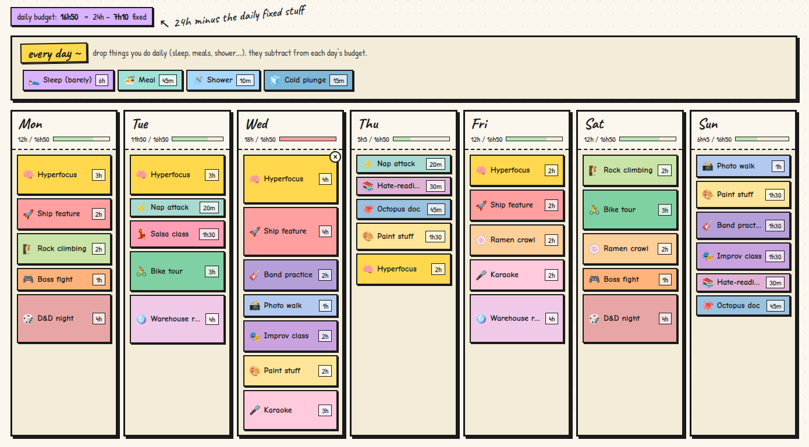

# time boxing !!

a tiny weekly planner where you drag activities onto days and see if your week **actually adds up**.



## the idea

I kept trying to plan my week in google calendar and it felt weird, because I don't actually care whether gym is at 6pm or 7pm — I care whether I've left 90 minutes for it at all.

so this is like a calendar, except:

- **no clock times.** a block is "gym, 90 min". it's not "gym, 6–7:30pm".
- **the order is just the order** you'd like to do things. drag to reorder.
- **same activity, different day, different length is fine.** gym can be 60m on tuesday and 90m on saturday. the block's identity is its *name*, not a row in a database.
- **sleep / meals / shower go in a "every day" strip** at the top. they subtract from each day's 24h, so the daily budget you see is *the time you actually have to plan*.
- **long blocks are taller, short blocks are shorter.** so a day full of small things looks different from a day with one big chunk.

it's one `index.html`. no build, no server, no accounts.

## how to use it

1. open `index.html` in a browser. that's it.
2. click **✎ activities** (top right) to pop out the palette.
3. drag an activity onto a day. drag it around to reorder. drag it to another day to move it.
4. click a block to tweak its duration. click the × in the corner to delete.
5. drag things like **sleep, meals, shower** into the "every day ~" strip at the top. watch the daily budget shrink.

## the budget math

```
daily budget = 24h − sum of everything in the "every day" strip
```

that's the number you see next to each day. the little progress bar under the day name fills up as you plan. it goes red if you over-book. it's not enforcing anything — it just *tells you*.

## colors and emoji

every block's color and emoji come from its **name**. two blocks called "Gym" will always look the same, everywhere.

- if there's an activity in your palette with that name, it uses its emoji + color.
- if not, the color is picked from a 27-swatch pastel palette using an **FNV-1a hash of the name**, so it's still stable across reloads. the emoji falls back to ✨.

which means: rename a block and it re-themes. delete a palette entry and the placed blocks keep their color (via the hash). share your timetable with a friend and the same activities show up the same way.

## sharing

- **Ctrl/Cmd+C** anywhere on the page → copies your whole timetable to the clipboard as JSON.
- **Ctrl/Cmd+V** → pastes a timetable in. asks first if you already have blocks.
- or use the **📋 copy** / **📥 paste** buttons at the bottom.

you can also hand-edit JSON and paste it. see `sample/sample.json` for a chill week, and `sample/exciting.json` for one that deliberately over-books wednesday.

## where the data lives

`localStorage`, under the key `timeboxing-zine-v1`. that's it. no server, no cookies, no telemetry. clearing your browser storage clears your timetable.

## the data shape

if you want to script things, the JSON looks like:

```json
{
  "activities": [
    { "id": "a-gym", "name": "Gym", "emoji": "🏋️", "color": "#b8e6b2", "defaultDurationMinutes": 60 }
  ],
  "blocks": [
    { "id": "b1", "dayIndex": 0, "orderIndex": 0, "name": "Gym", "durationMinutes": 90 }
  ],
  "settings": {}
}
```

- `dayIndex` is `0..6` for Mon..Sun, and `-1` for the "every day" strip.
- `orderIndex` is the position within a day.
- blocks only store `name` and `durationMinutes` — color and emoji are derived.

## keyboard shortcuts

| key | what it does |
| --- | --- |
| `Ctrl/Cmd + C` | copy the whole timetable to clipboard |
| `Ctrl/Cmd + V` | paste a timetable from clipboard |
| `Esc` | close modals / the activity panel |
| `Enter` in a confirm dialog | ok |

the copy/paste shortcuts don't fire when you're typing in an input or have text selected — your normal copy/paste still works there.

## why it looks like this

I wanted something paper-feeling and a little silly so planning doesn't feel like doing admin. the fonts are **Caveat**, **Patrick Hand** and **Comic Neue**. the palette is 27 soft pastels. the emoji picker is [`emoji-picker-element`](https://github.com/nolanlawson/emoji-picker-element). the logo is two clocks boxing each other, obviously.
